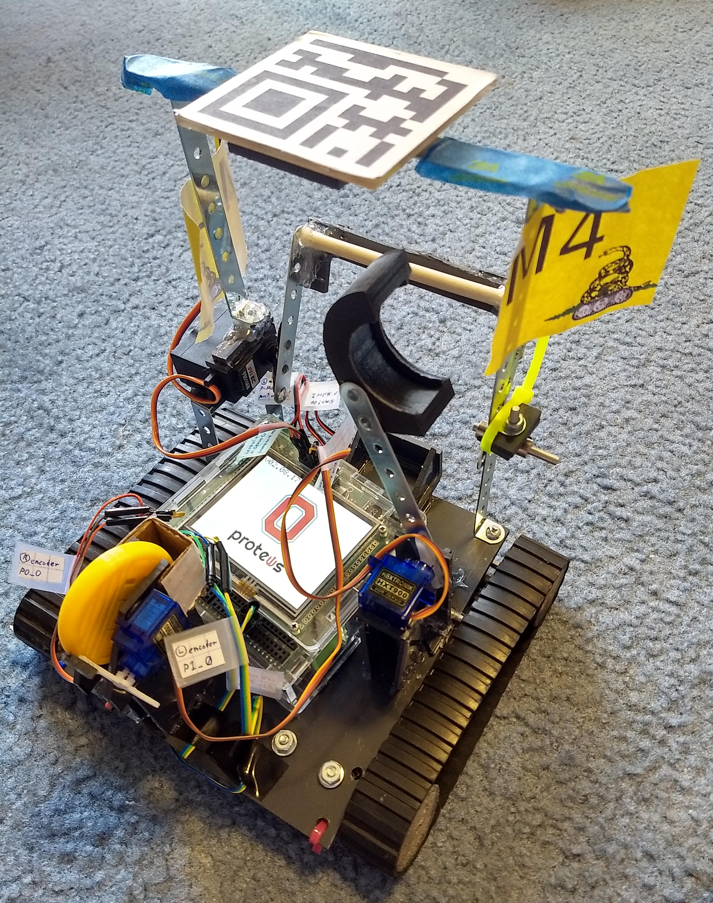

# MC4BOT
C++ code for the OSU FEH robot project

## Introduction

Each year, Ohio State's Fundamentals of Engineering Honors classes participate in a semester-long project to build a robot. The goal of the robot is to complete that year's challenge course, constructed by the Engineering Education Department (EED) staff and teaching assistants, in under 2 minutes. I wrote most of the code for my group's robot, pictured below.

A picture of the course layout (courtesy of the EED) for our class (Spring 2019) is also included below. Tasks included reading light colors, pushing and holding buttons, flipping levers, moving score sliders, and depositing a token into a slot. A full description of the challenge scenario can be found in [this document from the EED.](https://osu.app.box.com/s/zog158rufpkat23gt6ziwpx3r4wr000b)

Our robot had noticeable mechanical issues from its tread-based drivetrain, but this code was able to drive the robot to a perfect run during the final competition. A video of this run can be found [here.](https://youtu.be/jPylJhgtDp8?t=7669) A full video of the competition can be found [on YouTube.](https://youtu.be/jPylJhgtDp8)

## Setup

## Abilities

## Future Improvements

## Licenses
This code is free to use and available under the GPLv3 license. Full license text for this project is located in the LICENSE file.